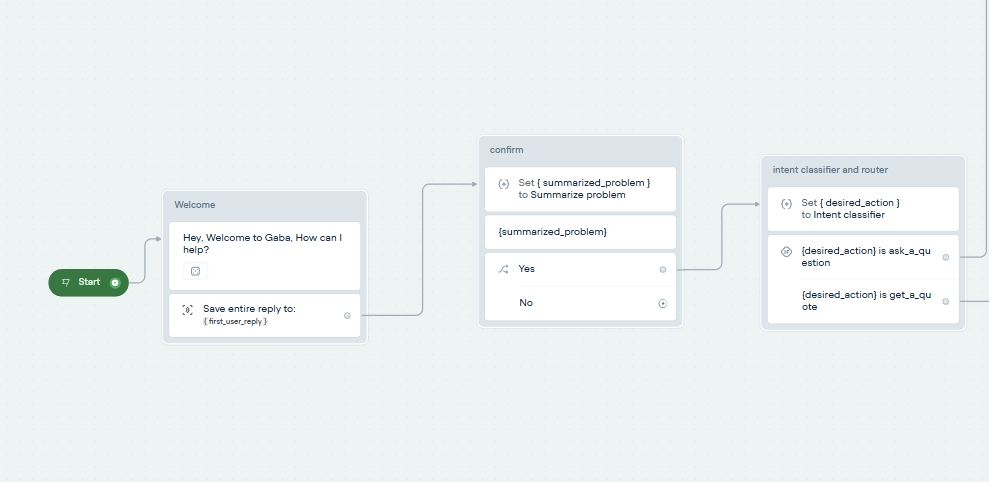

# voiceflow-chatbot-tutorial
A basic chatbot setup in Voiceflow designed to cover foundational concepts, providing the knowledge needed to expand it into a more advanced assistant capable of handling multiple tasks—or seamlessly transferring the conversation to a human agent when it’s unable to respond effectively.

## 📥 Downloadable Files

- 📄 [Download Tutorial PDF](./Voiceflow chatbot.pdf)
- 📁 [Download Voiceflow Project (.vf)](./Voiceflow chatbot.pdf)

## 🙏 Final Thoughts
This project is a simple example of what's possible with Voiceflow. With additional blocks and integrations, you can transform this into a powerful digital assistant capable of handling complex conversations, storing user data, booking appointments, and much more.

Thanks for checking out this project!
– Naveen Baburaj
